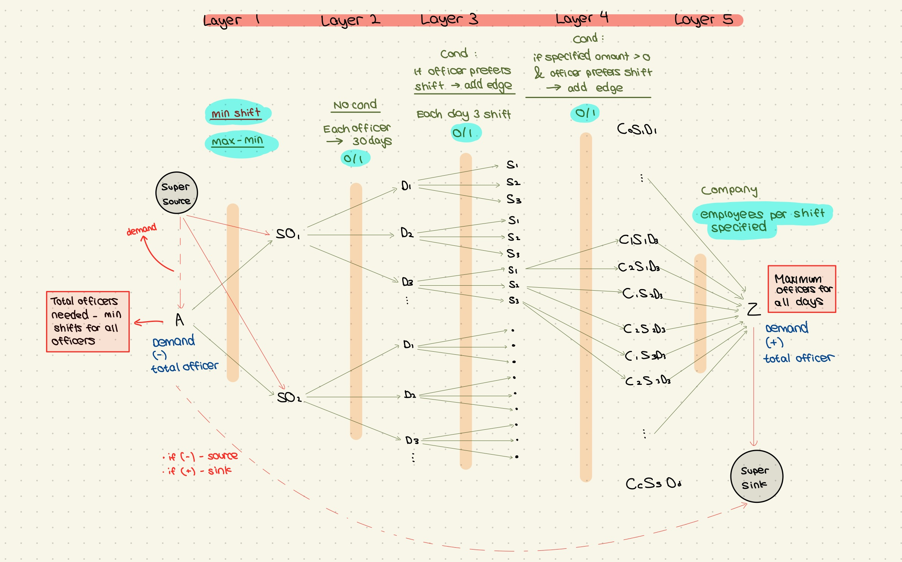

# Officer Allocation - Network Flow

A Python implementation using Ford-Fulkerson algorithm with flow networks to optimally assign security officers to companies based on preferences, shift requirements, and constraints.

## Project Overview

This project solves the security officer allocation problem where officers must be assigned to companies for 30-day shifts. Each officer has shift preferences, and each company requires specific numbers of officers per shift. The system ensures all constraints are met using maximum flow algorithms.

## Algorithm Approach

### Flow Network with Demand Nodes

The solution uses **Ford-Fulkerson with BFS (Edmonds-Karp)** on a multi-layer bipartite graph:

#### Layer 1: Super Source → Officers
- **Super Source** to each officer: capacity = `min_shifts`
- **Source** to each officer: capacity = `max_shifts - min_shifts`
- Ensures officers work within min/max bounds

#### Layer 2: Officers → Days
- Each officer to 30 day nodes: capacity = 1
- Ensures one shift per day per officer

#### Layer 3: Days → Shifts
- Each day to 3 shift nodes: capacity = 1
- Only if officer prefers that shift
- Creates preference-aware connections

#### Layer 4: Shifts → Companies
- Shift nodes to company nodes: capacity = 1
- Only if company needs officers for that shift
- Only if officer prefers that shift

#### Layer 5: Companies → Sink
- Each company to sink: capacity = officers needed
- **Sink** to **Super Sink**: capacity = total demand

#### Demand Balancing
- **Super Source Demand**: `-(total_officers_needed) + (min_shifts × num_officers)`
- **Super Sink Demand**: Total officers needed across all companies

### Why This Works

By using demand nodes:
- **Guarantees minimum shifts** through super source
- **Limits maximum shifts** through regular source
- **Validates feasibility** through max flow comparison
- **Handles preferences** through conditional edge creation

## Usage

### Basic Example

```python
from officer_allocation import allocate

# Officer preferences: preferences[i][k] = 1 if officer i prefers shift k
preferences = [
    [1, 1, 0],  # Officer 0: prefers shifts 0 and 1
    [0, 1, 1],  # Officer 1: prefers shifts 1 and 2
    [1, 0, 1]   # Officer 2: prefers shifts 0 and 2
]

# Company requirements: officers_per_org[j][k] = number needed for shift k
officers_per_org = [
    [1, 1, 1],  # Company 0: needs 1 officer per shift
    [1, 0, 1]   # Company 1: needs officers for shifts 0 and 2
]

# Shift constraints
min_shifts = 5   # Minimum shifts per officer per month
max_shifts = 20  # Maximum shifts per officer per month

# Get allocation
result = allocate(preferences, officers_per_org, min_shifts, max_shifts)

if result is not None:
    # result[officer][company][day][shift] = 1 if assigned
    print("Valid allocation found!")
else:
    print("No valid allocation exists")
```

### Input Format

**Preferences**: 2D list where `preferences[i][k]` = 1 if officer i prefers shift k
```python
preferences = [
    [1, 0, 1],  # Officer 0 prefers shifts 0 and 2
    [1, 1, 0],  # Officer 1 prefers shifts 0 and 1
]
```

**Officers Per Org**: 2D list where `officers_per_org[j][k]` = officers needed for shift k
```python
officers_per_org = [
    [2, 1, 1],  # Company 0 needs 2, 1, 1 officers for shifts 0, 1, 2
    [1, 2, 0],  # Company 1 needs 1, 2, 0 officers for shifts 0, 1, 2
]
```

**Shift Constraints**: Integers
```python
min_shifts = 10  # Minimum shifts per month
max_shifts = 25  # Maximum shifts per month
```

### Output Format

Returns 4D list or None:
```python
allocation[officer][company][day][shift] = 1  # Officer assigned
allocation[officer][company][day][shift] = 0  # Officer not assigned
None  # No valid allocation exists
```

## Complexity Analysis

### Allocate Function

**Time Complexity**: O(M × N²)
- M: Number of companies
- N: Number of officers
- Ford-Fulkerson: O(V × E²) where V = O(N + M), E = O(M × N)
- Flow iterations: Each augmenting path takes O(V + E)
- Maximum flows: O(V × E) in worst case
- Dominant factor: O(M × N²)

**Space Complexity**: O(N × M)
- Graph vertices: O(N + M + constant nodes)
- Graph edges: O(M × N × days × shifts) = O(M × N)
- Allocation list: O(N × M × 30 × 3) = O(N × M)
- Dominant factor: O(N × M)

### Graph Construction

**Time Complexity**: O(M × N)
- Officer layer: O(N)
- Days layer: O(N × 30) = O(N)
- Shifts layer: O(N × 30 × 3) = O(N)
- Companies layer: O(M × 30 × 3) = O(M)
- Edge connections: O(N × M × 30 × 3) = O(M × N)

**Space Complexity**: O(M × N)
- Vertices: O(N + N×30 + N×90 + M×90 + 4) = O(N + M)
- Edges: O(M × N × 90) = O(M × N)

### Ford-Fulkerson (Edmonds-Karp)

**Time Complexity**: O(V × E²)
- V: Number of vertices = O(N + M)
- E: Number of edges = O(M × N)
- Each BFS: O(V + E)
- Number of augmentations: O(V × E)

**Space Complexity**: O(V + E)
- Distance arrays: O(V)
- Visited arrays: O(V)
- Queue: O(V)

## Graph Visualization

```
[Super Source]
    |
    | (min_shifts)
    ↓
[Officers Layer] ← (max-min) ← [Source]
    |
    | (1 per day)
    ↓
[Days Layer (N×30)]
    |
    | (1 if preferred)
    ↓
[Shifts Layer (N×30×3)]
    |
    | (1 if needed & preferred)
    ↓
[Companies Layer (M×30×3)]
    |
    | (exact requirement)
    ↓
[Sink] → (total capacity) → [Super Sink]
```

Full visualization: 


## Testing

```bash
python test_OA_1.py
python test_OA_2.py
python test_OA_3.py
python test_OA_4.py
```

Test cases should verify:
- Simple valid allocations
- No valid allocation (impossible constraints)
- Edge cases (min = max shifts)
- Preference limitations
- Multiple companies with varying demands
- Boundary cases (0 officers, 0 companies)